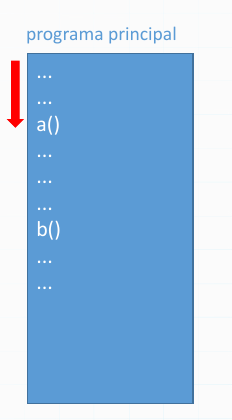
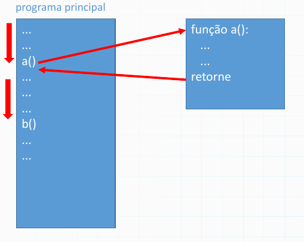
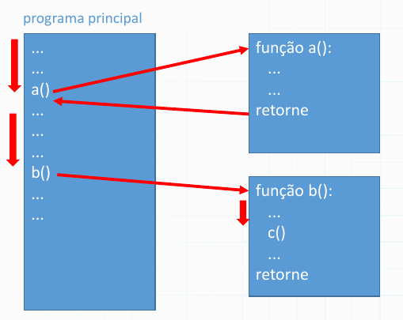
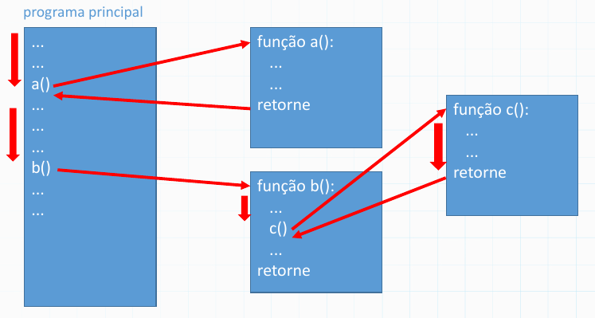
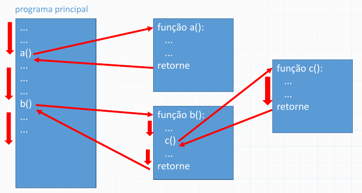

#  Rotinas e Tipos Compostos

-----------

## Introdução a Modularização

Ao desenvolver programas mais complexos, começamos a ter problemas de repetição de código, o que nos força a adotar estratégias de *modularização* do código, de forma a reaproveitar partes repetitivas.

Para reaproveitar implementações de algoritmos nós utilizaremos as *rotinas*, também conhecidas como *subrotinas*, *métodos*, etc, que se dividem entre *funções* e *procedimentos*.
Iremos estudar ambos nessa aula.

Outra forma de modularização se refere ao uso tipos compostos agregados, conhecidos como *registros*, *estruturas* ou também *classes*.
Também aprenderemos nessa aula como criar tipos mais complexos, com base nos tipos básicos da linguagem.

Em aulas futuras, retomaremos o assunto com as *corrotinas*, que trazem outras formas de modularização, similares a funções.

-----------

## Motivação

Considere o código abaixo:

::::::::::::: {.columns}

::::: {.column width=55%}

```{.py}
x=0

n = 4
f = 1
i = 1
while i<=n:
   f = f * i
   i = i + 1
x = x + f

n = 7
# continua do lado direito...
```
:::::

::::: {.column width=45%}
```{.py}
f = 1
i = 1
while i<=n:
   f = f * i
   i = i + 1
x = x + f

n = 5
# ... recalcula f
x = x + f

print(x) # 5184
```
:::::

:::::::::::::


- **Pergunta:** O que ele faz? O que significa f?

. . . 

- **Resposta:** Calcula o valor 4!+7!+5! = 24+5040+120 = 5184

-------

## Rotinas do Tipo Função

Para evitar repetição de código, podemos criar uma função *fatorial*, que tem **parâmetro** $n$ e **retorna** $n!$.
Considere a função à direita. 

::::::::::::: {.columns}

::::: {.column width=55%}

```{.py}
x=0

n = 4
f = 1
i = 1
while i<=n:
   f = f * i
   i = i + 1
x = x + f

n = 7
# código longo...
#   e repetitivo...
print(x) # 5184
```
:::::

::::: {.column width=45%}
```{.py}
x=0

def fatorial(n):
   f = 1
   i = 1
   while i<=n:
      f = f * i
      i = i + 1
   return f
a=4
x = x + fatorial(a)
x = x + fatorial(7)
x = x + fatorial(5)
print(x) # 5184
```
:::::

:::::::::::::

-------

## Rotinas Paralisam a Execução

Rotinas paralisam a execução toda vez que são invocadas:

```{.py}
x=0
# usando função fatorial com argumentos 4, 7 e 5...

x = x + fatorial(4)
#                   -->
#                        def fatorial(n=4):
#                             computa fatorial f=1*2*3*4=24
#                             retorna f
#                   <--
# x = x   +   24
x = x + fatorial(7)
#                   -->
#                        def fatorial(n=7):
#                            ...
print(x) # 5184
```

-------

## Fluxo de Execução com Chamadas Aninhadas (1/5)

{height=70%}

-------

## Fluxo de Execução com Chamadas Aninhadas (2/5)

{height=70%}

-------


## Fluxo de Execução com Chamadas Aninhadas (3/5)

{height=70%}

-------


## Fluxo de Execução com Chamadas Aninhadas (4/5)

{height=70%}

-------


## Fluxo de Execução com Chamadas Aninhadas (5/5)

{height=70%}

-------


## Como Declarar uma Função?

No Python, para declarar uma função, basta usar `def`, nomeando a função e cada um de seus parâmetros (pode não ter nenhum!).

::::::  {.block}

### Sintaxe do `def`

```{.py}
def nome_da_funcao(parametro1, parametro2, ..., parametro):
    <comandos>
    return <variável ou valor>
    ou...
    return
    ou...
    nada! já retorna automaticamente na última linha!
```

::::::

Observe que o retorno é opcional, e que quando não há retorno, chamamos a rotina de *procedimento*.
Toda rotina finaliza sua execução ao retornar, ou finaliza automaticamente na última linha.
 

-------

## Mais exemplos com While

::::::::::::: {.columns}

::::: {.column width=55%}

```.py
num = 100
pares = 0
while num <= 200:
   if num % 2 == 0
       pares = pares + 1
   num = num + 1
print(pares)
```

:::::

. . .

::::: {.column width=45%}

```.py
num = 100
pares = 0
continua = True

while continua:
   if num % 2 == 0:
      pares = pares + 1
   num = num + 1
   if num > 200:
      continua = False
print(pares)
```

:::::

:::::::::::::


-------

## Padrão while(True) / break

Em algumas situações, é útil ter um laço infinito:

```.py
while True:
   # faça algo útil!
```

Mas como escapar desse laço infinito?

. . . 

```.py
num = 100
contador_pares = 0
while True:
   if num % 2 == 0:
      contador_pares = contador_pares + 1
   num = num + 1
   if num > 200:
      break
print(contador_pares)
```

-------

## Padrão while(True) / break / continue

Em algumas situações, é útil ter um laço infinito:

```.py
num = 99
contador_pares = 0
while True:
    num = num + 1
    if num > 200:
        break
    if num % 2 != 0:
        continue  # o que isso faz?
    contador_pares = contador_pares + 1
print(contador_pares)
```

**Pergunta:** Por que começamos com 99?


-------

## Padrão for-range em repetições contáveis

A repetição contável, ou laço tipo `for-range`, é muito utilizado em python.
Esse conceito será melhor explicado no futuro, porém apresentamos brevemente a estrutura de um for-range básico (simplemente, uma variavel e um intervalo de continuação/incremento):

::::::::::::: {.columns}

::::: {.column width=55%}

```.py
numero = 1
while numero <= 100:
   print(numero)
   numero = numero + 1
```

:::::

. . .

::::: {.column width=45%}

```.py
for numero in range(1, 101):
   print(numero)
```

:::::

:::::::::::::

A estrutura é bastante compacta e muito utilizada na prática!
Porém, ela mascara alguns comportamentos internos do python que serão melhor discutidos no futuro.

**Dica:** Busque utilizar e praticar o laço do tipo `while`, pois ele permite construir *qualquer tipo* de repetição, não apenas contáveis como `for`.

**Pergunta:** O que acontece com `break` e `continue` em um laço `for`? Pratique!

-------

## Laços Aninhados

Seguir com material do prof Yuri

-----

## Reprodução do material

Esses slides foram escritos utilizando pandoc, segundo o tutorial ilectures:

- https://igormcoelho.github.io/ilectures-pandoc/

Exceto expressamente mencionado (com as devidas ressalvas ao material cedido por colegas), a licença será Creative Commons.

**Licença:** CC-BY 4.0 2025

Igor Machado Coelho

-------

## This Slide Is Intentionally Blank (for goomit-mpx)
